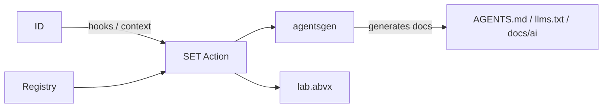

<p align="center">
  
</p>

# SET

[](https://github.com/markoblogo/SET/releases)
[](https://github.com/markoblogo/SET/actions/workflows/set.yml)
[](https://github.com/markoblogo/SET/blob/main/LICENSE)

Thin orchestration repo for the ABVX stack to keep AI-facing repo artifacts in sync.

`SET` is not a replacement for Copilot/Cursor/Continue. It is a workflow control plane: it orchestrates existing tools, makes run plans explicit, and keeps outputs predictable for CI and agents.

## Quick start (30 seconds)

Use this in any repo to baseline `AGENTS.md` and checks via `agentsgen`:

```yaml
- uses: markoblogo/SET@v0.1.0
  with:
    workflow_preset: repo-docs
    path: "."
```

If you're not ready to wire `.github/workflows/set.yml` manually, run `plan-config` locally first:

```bash
python3 scripts/plan_config_apply.py markoblogo/<owner/repo> --format json
```

This is a read-only plan showing the exact workflow file that would be generated.

## Who this is for

- Solo devs: one-command AI-ready repo baseline (`agentsgen`, checks, repomap, optional proofs).
- Team maintainers: one central registry for many repos with CI-drift visibility.
- Tool builders: stable registry and planner artifacts for control-plane integrations.

## What SET Does

- `agentsgen` handles repo documentation, map generation, checks, and related contracts.
- `SET` chooses how and when `agentsgen` and other tools run.
- `ID` and other optional integrations are executed via explicit, validated repo config.
- `lab.abvx` is the public catalog and read-only control-plane surface.



### Core roles

- `repo-docs` preset: `init + pack + check`
- `site-ai` preset: `repo-docs + site pack + analyze + meta`
- `minimal` preset: bootstrap only

## Repo config contract

`SET` owns the first centralized contract and registry baseline for repo-level orchestration.

- Contract docs: `docs/repo-config.md`
- Schema: `schema/repo-config.v1.json`
- Registry: `registry/repos/*.json`
- Validation: `python3 scripts/validate_registry.py`

The contract includes:
- tooling intent (`tools.agentsgen`, `tools.id`, `tools.git_tweet`)
- presets and overrides (`workflow_preset` inputs)
- repomap policy (`compact_budget`, `top_ranked_files`, `focus`, `changed`)
- proof-loop contract metadata
- optional `site` baseline for catalog-facing pages

There is an additional runtime artifact, `agents.knowledge.json`, that is generated by `agentsgen` and consumed by AI tooling. It is intentionally separate from control-plane registry data.

## Config apply planning (`scripts/plan_config_apply.py`)

Current behavior is intentionally planning-only:
- shows one-file proposed workflow diff as structured output
- exports review artifacts (`plan.json`, `workflow.set.yml`, `pr-body.md`, etc.)
- performs repo drift check with `--repo-root` (`matches`, `drift`, `missing`)
- never writes target repos (review-first only)

Useful commands:

```bash
python3 scripts/plan_config_apply.py markoblogo/lab.abvx
python3 scripts/plan_config_apply.py markoblogo/lab.abvx --dry-run --format json
python3 scripts/plan_config_apply.py markoblogo/lab.abvx --export-dir ./.set-plan
python3 scripts/plan_config_apply.py markoblogo/lab.abvx --repo-root /path/to/lab
```

## Getting started docs

- `docs/repo-config.md`
- `docs/config-apply-planning.md`
- `docs/llmo-capability-map.md`
- `docs/v0.1-scope.md`
- `CONTRIBUTING.md`

## Links

- SET repo: https://github.com/markoblogo/SET
- Lab catalog: https://github.com/markoblogo/lab.abvx
- ID protocol: https://github.com/markoblogo/ID
- agentsgen: https://github.com/markoblogo/AGENTS.md_generator
