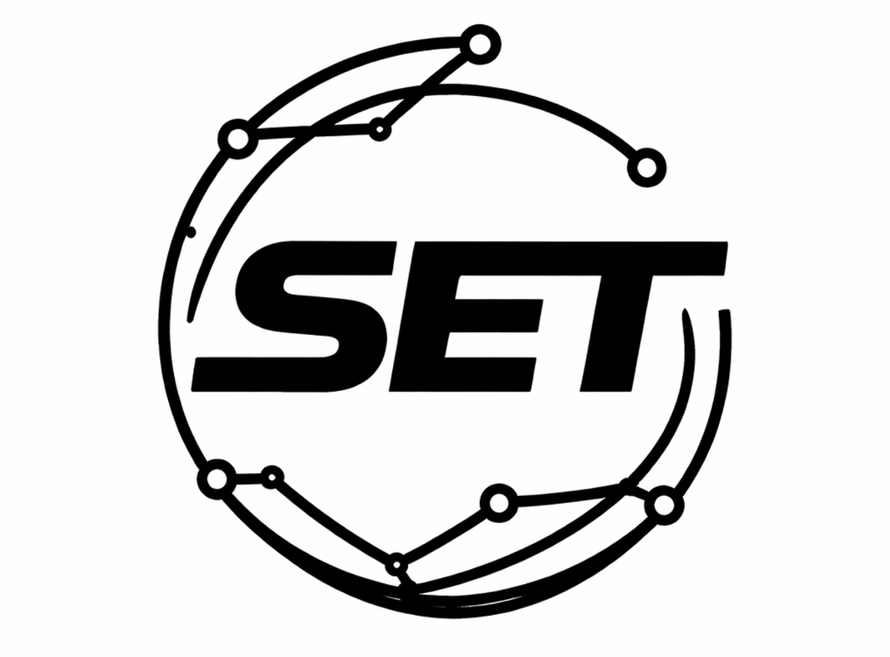

<p align="center">
  
</p>

# SET

[](https://github.com/markoblogo/SET/releases)
[](https://github.com/markoblogo/SET/actions/workflows/set.yml)
[](https://github.com/markoblogo/SET/blob/main/LICENSE)

Thin orchestration repo for the ABVX development tools ecosystem.

It stays deliberately small: presets define a baseline, and explicit inputs override the preset when you need per-repo control.

Current working definition:
- `agentsgen` = repo intelligence runtime
- `SET` = orchestration layer / GitHub Action entrypoint
- `lab.abvx` = public catalog and read-only control plane
- `ID` = portable human-AI profile protocol plus repo-local integration hooks for cross-tool context transfer
- standalone tools such as `git-tweet` stay independent and are integrated by contract

This repo stays intentionally thin even after adding registry, planning, and drift-check layers.

## Quickstart

```yaml
- uses: markoblogo/SET@v0.1.0
  with:
    workflow_preset: "repo-docs"
    path: "."
```

## Example usage

```yaml
- uses: markoblogo/SET@v0.1.0
  with:
    workflow_preset: "site-ai"
    agentsgen: "true"
    init: "true"
    pack: "true"
    site_pack: "true"
    site_url: "https://example.com"
    check: "true"
    repomap: "true"
    repomap_compact_budget: "4000"
    repomap_focus: "cli"
    repomap_changed: "false"
    analyze: "true"
    analyze_url: "https://example.com"
    meta: "true"
    meta_url: "https://example.com"
    proof_loop: "true"
    proof_task_id: "proof-loop-v0"
    id_enabled: "true"
    id_owner_id: "markoblogo"
    id_target: "set"
    id_pre_task: "true"
    id_weekly_review: "true"
    autodetect: "true"
    path: "."
```

Preset baselines:
- `minimal` -> repo bootstrap only
- `repo-docs` -> init + pack + check
- `site-ai` -> repo-docs + site pack + analyze + meta

What v0.1 does:
- installs `agentsgen`
- runs `agentsgen init`
- optionally runs `agentsgen pack`
- optionally runs `agentsgen pack --site <url>`
- optionally runs `agentsgen check --all --ci`
- optionally runs `agentsgen understand --compact-budget <tokens>`
- optionally runs `agentsgen snippets`
- optionally runs `agentsgen analyze <url>`
- optionally runs `agentsgen meta <url>`
- optionally runs `agentsgen task init/evidence/verdict` as a proof-loop hook, including richer evidence/verdict summaries
- optionally runs repo-local `ID` integration hooks (`pre_task`, `weekly_review`) for ID-compatible repositories
- supports `workflow_preset` baselines with explicit input override
- writes a compact GitHub Actions summary for the resolved run plan
- passes a first-class repomap policy through to `agentsgen understand` (`--compact-budget`, optional `--focus`, optional `--changed`) with explicit policy modes: `full`, `focus`, `changed`, `focus+changed`
- owns the first central registry baseline for registered repos
- compares expected registry-derived `set.yml` against local repo workflows in read-only mode

## Repo config contract

`SET` now owns the first real repo-config contract and central registry baseline.

- Contract docs: `docs/repo-config.md`
- Canonical schema: `schema/repo-config.v1.json`
- Example config: `examples/repo-config.example.json`
- Central registry (first home): `registry/repos/*.json`
- Includes ID protocol repo baseline: `markoblogo/ID`
- Validate locally: `python3 scripts/validate_registry.py`
- `agentsgen.repomap_policy` lets each repo set compact budget, ranked-file limits, and optional focused/changed slice defaults without changing the Action contract
- `agentsgen.proof_loop` lets a repo opt into contract/evidence/verdict artifacts for larger tasks, including evidence status, blocker counts, review readiness, and optional expected-artifact blockers
- `id` lets a repo opt into repo-local ID integration hooks with explicit `owner_id`, `target`, `pre_task`, and `weekly_review` gates
- Derived policy modes in SET vocabulary: `full` (Full Repo Slice), `focus` (Focused Code Slice), `changed` (Changed Files Slice), `focus+changed` (Hybrid Slice)

## Config apply planning

Planning-only helper for future PR-based config apply:

- Docs: `docs/config-apply-planning.md`
- Command: `python3 scripts/plan_config_apply.py markoblogo/lab.abvx`
- JSON mode: `python3 scripts/plan_config_apply.py markoblogo/lab.abvx --format json`
- Review bundle export: `python3 scripts/plan_config_apply.py markoblogo/lab.abvx --export-dir /tmp/set-plan`
- gh-ready payload: includes `base`, `head`, `title`, and `body_file` fields for a later `gh pr create` step
- apply simulation: previews branch name, target file write, commit message, and manual apply commands
- batch mode: accepts multiple repos or `--all` for a planning-only multi-repo summary with status/priority hints
- operator hints: planner payload now includes `apply_readiness`, `operator_queue`, `blocked_by`, structured capability `wiring_gaps`, `next_action_label`, `recommended_operator_step`, and `next_shell_command` for UI/operator flows
- workflow loop closure: `python3 scripts/plan_config_apply.py markoblogo/lab.abvx --repo-root /absolute/path/to/repo` compares expected `set.yml` from registry against the real repo workflow and reports `matches`, `drift`, or `missing`
- repomap policy now flows through planning output so downstream control-plane views can show compact status and top ranked files per repo

## Current checkpoint

- Keep the GitHub Action thin
- Keep registry and planner contracts explicit
- Use reviewable planning and drift checks before any future apply automation

## Docs

- `docs/llmo-capability-map.md`
- `docs/v0.1-scope.md`

## Ecosystem links

- SET repo: https://github.com/markoblogo/SET
- Lab catalog: https://github.com/markoblogo/lab.abvx
- ID protocol repo: https://github.com/markoblogo/ID
- agentsgen repo: https://github.com/markoblogo/AGENTS.md_generator
