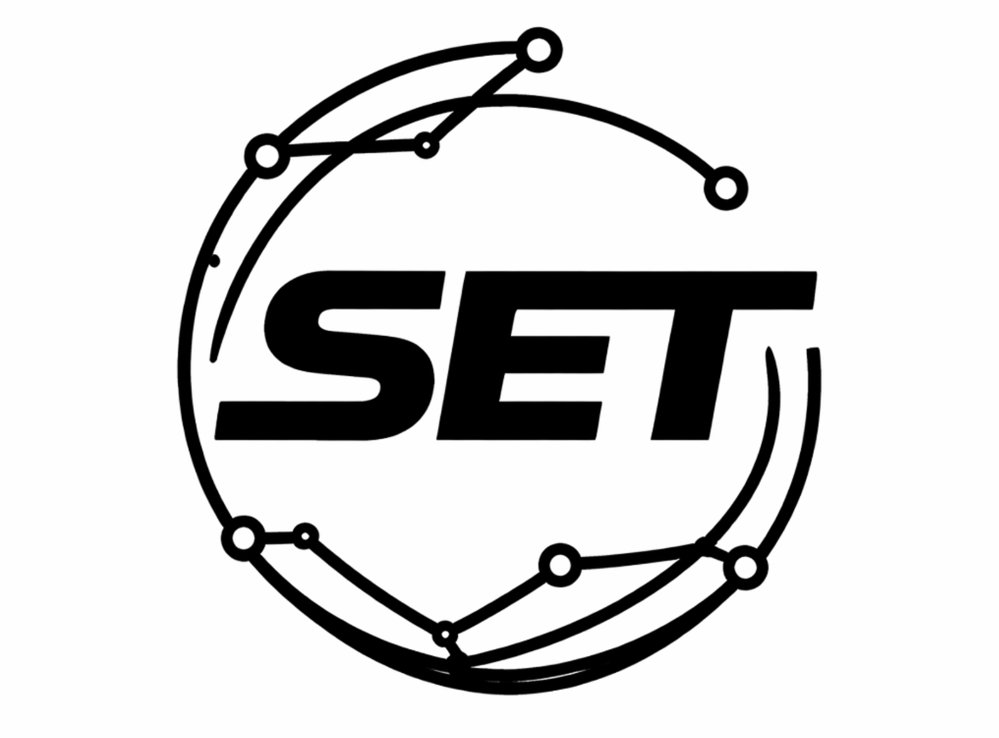

<p align="center">
  
</p>

# SET

[](https://github.com/markoblogo/SET/releases)
[](https://github.com/markoblogo/SET/actions/workflows/set.yml)
[](https://github.com/markoblogo/SET/blob/main/LICENSE)

`SET` is the thin orchestration layer in the ABVX stack.

It does not replace coding agents. It decides how repo tooling runs, makes workflow choices explicit, and keeps outputs predictable for CI and downstream agent flows.

## What It Orchestrates

- `agentsgen` for repo docs, pack artifacts, checks, and repo maps
- `ID` for optional human-context hooks
- proof-loop artifacts for durable review state
- registry-driven workflow presets across repos

## Quick Start

Use the action in a target repository:

```yaml
- uses: markoblogo/SET@main
  with:
    workflow_preset: repo-docs
    path: "."
```

If you want a review-first planning pass before touching workflow files:

```bash
python3 scripts/plan_config_apply.py markoblogo/<owner>/<repo> --format json
```

## Workflow Presets

- `repo-docs`: `init + pack + check`
- `site-ai`: `repo-docs + site pack + analyze + meta`
- `minimal`: bootstrap-only baseline

## ID Integration

When repo-local `ID` hooks are enabled, `SET` now does more than run `pre_task`.

It captures the resolved human bootstrap order and exports two runtime artifacts into the target repo:

- `docs/ai/id-bootstrap.json`
- `docs/ai/id-bootstrap.prompt.md`

These packets are built from the resolved `ID` hook output and are meant for downstream agent runs.

The JSON packet is now treated as a formal runtime interface, documented in `docs/id-bootstrap.md`, rather than as an action-only implementation detail.

Expected bootstrap order:

1. `soul.md`
2. `profile.core.md`
3. `handshake.md`

`SET` also surfaces that order in the GitHub step summary.

## Registry Contract

`SET` owns the orchestration registry and repo-config contract:

- schema: `schema/repo-config.v1.json`
- docs: `docs/repo-config.md`
- runtime artifact docs: `docs/id-bootstrap.md`
- examples: `examples/repo-config.example.json`
- registry entries: `registry/repos/*.json`

Validate the registry with:

```bash
python3 scripts/validate_registry.py
```

## Planning Mode

`scripts/plan_config_apply.py` is intentionally review-first:

- shows the proposed workflow as structured output
- exports planning artifacts such as `plan.json`, `workflow.set.yml`, `pr-body.md`, `orchestrator-bundle.json`, and `proposal-lifecycle.json`
- can compare against a local repo root for drift
- does not write target repositories directly

`orchestrator-bundle.json` is the upstream handoff contract for Sortie/Symphony-like runners: it carries repo identity, proposed workflow inputs, repomap policy, optional `ID` bootstrap hints, proof-loop expectations, recommended review lenses, proposal lifecycle guidance, and one registry-selected capability profile without making `SET` an agent runner. `baseline` exports only context/loop review hints; `research` adds diversity and optional memory guidance; `governed-runner` adds optional memory plus shadow-first governance; `loop-readiness` exports a disabled L1/L2 report-first contract; `loop-hardening` exports disabled harness-stripping, runtime-path sprint, and broken-window revalidation rules; `bounded-orchestration` exports a disabled Planner/Reviewer/Executor contract; `git-native-context` exports a disabled minimal ADR/RFC/rule/spec/plan/research/incident taxonomy; `bug-evidence` exports a disabled captured red-to-green evidence contract; `design-taste-review` exports disabled marketing/editorial taste routing and browser-verification rules; `agent-operations` exports disabled agent capability cards, async operation and decision receipts, source-linked adaptation deltas, trust-graded scoped memory, public/private state boundaries, and provider/tool capability routing; `skill-quality-pipeline` exports a disabled SkillOpt-style staged review contract for rollout evidence, bounded edits, held-out validation, rejected-edit memory, and `best_skill.md` export without self-editing. `proposal-lifecycle.json` spells out the proposal-first flow (`run -> retained_output -> inspect -> select/apply/discard`). `rabbithole.seed.md` is also exported as an optional local review seed for human-in-the-loop plan exploration.

The bundle also exports an optional `agent_governance_capability`: a shadow-first contract for a runner-owned policy decision before significant tool calls, append-only audit records, and per-run tool/cost/latency telemetry. It has no runtime dependency and is disabled by default. See `docs/agent-governance-capability-contract.md`.

Terminal agent multiplexers such as `herdr` are treated as optional runner UI references only. SET may define the state and evidence a runner should display, but it does not vendor, install, spawn, detach, reattach, or approve agent sessions. See `docs/terminal-agent-multiplexer-reference.md`.

Post-task closeout is proposal-first: check docs drift, used/skipped agent rules, memory or handoff need, leftovers, green/yellow/red cleanup risk, and a short changed/verified/skipped/follow-up receipt. It is not automatic cleanup. See `docs/task-closeout-audit-contract.md`.

External AI engineering repositories are implementation references, not ABVX dependencies. Catalog them with category, source path, adaptation needs, data-egress risk, allowed pilots, and status before any local adoption. See `docs/external-ai-engineering-references.md`.

AI visibility can also be tracked as a repeated local audit loop for public surfaces such as personal sites, project pages, books, and AzurMenton. `SET` treats this as artifact-first analytics, not a GEO runtime. Use `docs/ai-visibility-audit-contract.md`, `docs/ai-visibility-personal-site-template.md`, `docs/ai-visibility-azur-menton-template.md`, and `docs/ai-visibility-weekly-artifact-template.md`.

Project-memory capability now also defines a compact OpenViking-style tiered retrieval adaptation: `L0/L1/L2` loading, a retrieval-trajectory receipt, and minimal retrieval observability. It remains provider-neutral and does not install a context server or vector runtime. See `docs/memory-capability-contract.md`.

Continuous background review is also treated as an optional local policy, not a default runtime layer. `SET` only recommends it for selected code-heavy repos and starts from `manual` or `pre-push` modes before any post-commit automation. See `docs/continuous-review-boundary-contract.md`.

Chat-bot or IM-facing assistant architecture is also treated as an explicit boundary decision, not a default product direction. `SET` uses a compact chat-surface card plus source/authority/retention guards before any project adopts a chat-first surface. See `docs/chat-surface-boundary-contract.md`.

Public-facing repository homepages can also use a compact README-surface audit contract: audit clarity, hierarchy, trust, and maintenance cost first; only then decide whether any rewrite or asset work is warranted. See `docs/readme-surface-audit-contract.md` and `docs/readme-surface-audit-shortlist.md`.

Selected `12-factor-agents` principles are adapted as local doctrine only: owned context, structured outputs, unified state, pause/resume with explicit control flow, compact error packets, small focused agents, and stateless-reducer tests. `SET` does not become a framework runtime. See `docs/twelve-factor-agent-adaptation.md`.

Useful commands:

```bash
python3 scripts/plan_config_apply.py markoblogo/lab.abvx
python3 scripts/plan_config_apply.py markoblogo/lab.abvx --dry-run --format json
python3 scripts/plan_config_apply.py markoblogo/lab.abvx --export-dir ./.set-plan
python3 scripts/plan_config_apply.py markoblogo/lab.abvx --repo-root /path/to/lab
```

## Outputs

Depending on preset/config, `SET` can drive production of:

- `AGENTS.md`, `RUNBOOK.md`
- `llms.txt` / `LLMS.md`
- `docs/ai/id-context.json`
- `docs/ai/id-bootstrap.json`
- `docs/ai/id-bootstrap.prompt.md`
- repo maps and AI docs under `docs/ai/`
- proof-loop artifacts under `docs/ai/tasks/<task-id>/`

## Companion Layers

- `agentsgen`: repo-scoped agent context
- `ID`: portable human context
- `lab.abvx`: public catalog/read-only surface

## Key Docs

- `docs/repo-config.md`
- `docs/id-bootstrap.md`
- `docs/config-apply-planning.md`
- `docs/orchestrator-compatibility.md`
- `docs/context-budget-hint.md`
- `docs/loop-readiness-hint.md`
- `docs/loop-readiness-contract.md`
- `docs/loop-hardening-contract.md`
- `docs/bounded-orchestration-contract.md`
- `docs/git-native-context-contract.md`
- `docs/bug-evidence-contract.md`
- `docs/design-taste-review-contract.md`
- `docs/agent-operations-contract.md`
- `docs/skill-quality-pipeline-contract.md`
- `docs/research-diversity-hint.md`
- `docs/references/open-notebook.md`
- `docs/references/agent-orchestrators.md`
- `docs/memory-capability-contract.md`
- `docs/continuous-review-boundary-contract.md`
- `docs/chat-surface-boundary-contract.md`
- `docs/readme-surface-audit-contract.md`
- `docs/readme-surface-audit-shortlist.md`
- `docs/agent-governance-capability-contract.md`
- `docs/terminal-agent-multiplexer-reference.md`
- `docs/task-closeout-audit-contract.md`
- `docs/external-ai-engineering-references.md`
- `docs/ai-visibility-audit-contract.md`
- `docs/ai-visibility-personal-site-template.md`
- `docs/ai-visibility-azur-menton-template.md`
- `docs/ai-visibility-weekly-artifact-template.md`
- `docs/twelve-factor-agent-adaptation.md`
- `docs/capability-profiles.md`
- `docs/llmo-capability-map.md`
- `docs/v0.1-scope.md`
- `CONTRIBUTING.md`


- Added compact local `AGENTS.md_generator`-style pilot contract for `SET` with `accepted/used/confirmed` route states, pack/check validation markers, and PR-guard workflow.
